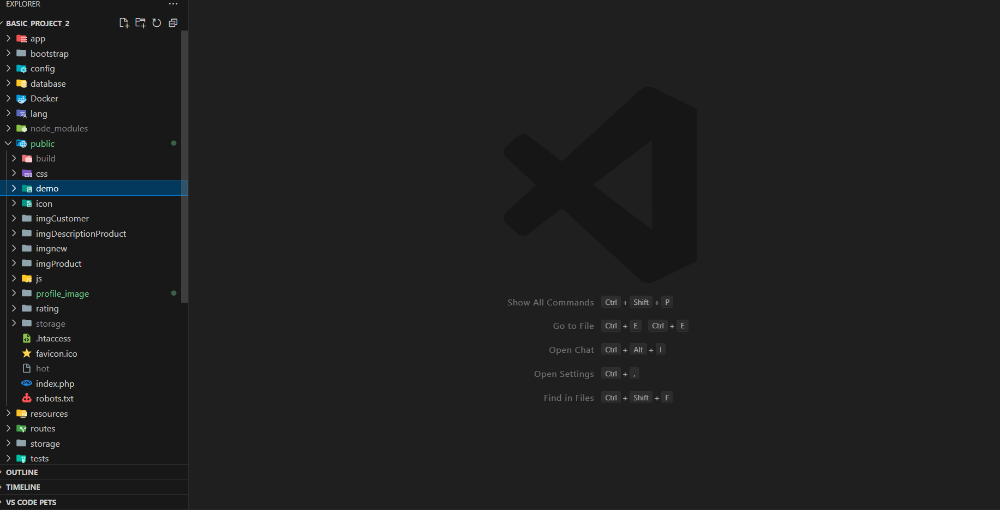

<!DOCTYPE html>
<html lang="vi">
<head>
    <meta charset="UTF-8">
    <meta name="viewport" content="width=device-width, initial-scale=1.0">
    <title>Laravel Framework</title>
    
</head>
<body>

    <header>
        <h1>Laravel Framework</h1>
        
        
<a href="https://laravel.com">Visit Laravel</a>

    </header>

    <section>
        <h2>Thông Tin Về Laravel</h2>
        
Laravel là một framework ứng dụng web với cú pháp biểu cảm và tinh tế. Laravel giúp việc phát triển trở nên thú vị và sáng tạo, đồng thời giảm bớt những công việc nhàm chán bằng cách đơn giản hóa các tác vụ thường gặp trong nhiều dự án web như:

        <ul>
            <li><a href="https://laravel.com/docs/routing">Bộ định tuyến đơn giản và nhanh chóng</a></li>
            <li><a href="https://laravel.com/docs/container">Container phụ thuộc mạnh mẽ</a></li>
            <li><a href="https://laravel.com/docs/session">Hỗ trợ nhiều backend cho session và cache</a></li>
            <li><a href="https://laravel.com/docs/eloquent">ORM (Eloquent) mạnh mẽ, dễ sử dụng</a></li>
            <li><a href="https://laravel.com/docs/migrations">Di chuyển cơ sở dữ liệu không phụ thuộc vào DB</a></li>
            <li><a href="https://laravel.com/docs/queues">Xử lý job nền tảng mạnh mẽ</a></li>
            <li><a href="https://laravel.com/docs/broadcasting">Phát sóng sự kiện thời gian thực</a></li>
        </ul>
        
Laravel giúp việc phát triển web trở nên dễ dàng hơn, đồng thời cung cấp đầy đủ công cụ cho các ứng dụng lớn, mạnh mẽ.

    </section>

    <section>
        <h2>Học Laravel</h2>
        
Laravel cung cấp một tài liệu vô cùng chi tiết và dễ tiếp cận, giúp bạn bắt đầu làm quen với framework nhanh chóng. Hãy tham khảo <a href="https://laravel.com/docs">Tài liệu Laravel</a> để có cái nhìn sâu sắc về các tính năng của Laravel.

        
Nếu bạn muốn thực hành, hãy thử ngay <a href="https://bootcamp.laravel.com">Laravel Bootcamp</a>, nơi bạn sẽ được hướng dẫn qua từng bước xây dựng một ứng dụng Laravel từ đầu.

        
Nếu không muốn đọc, bạn có thể học qua video trên <a href="https://laracasts.com">Laracasts</a> - thư viện video với hơn 2000 bài học bao gồm Laravel, PHP hiện đại, unit testing và JavaScript.

    </section>

    <section>
        <h2>Các Nhà Tài Trợ của Laravel</h2>
        
Laravel xin gửi lời cảm ơn đến các nhà tài trợ sau đây đã hỗ trợ tài chính cho sự phát triển của Laravel. Nếu bạn muốn trở thành nhà tài trợ, hãy ghé thăm trang <a href="https://patreon.com/taylorotwell">Patreon của Laravel</a>.

        <h3>Các Đối Tác Cao Cấp</h3>
        <ul>
            <li><a href="https://vehikl.com/">Vehikl</a></li>
            <li><a href="https://tighten.co">Tighten Co.</a></li>
            <li><a href="https://kirschbaumdevelopment.com">Kirschbaum Development Group</a></li>
            <li><a href="https://64robots.com">64 Robots</a></li>
            <li><a href="https://cubettech.com">Cubet Techno Labs</a></li>
            <li><a href="https://cyber-duck.co.uk">Cyber-Duck</a></li>
            <li><a href="https://www.many.co.uk">Many</a></li>
            <li><a href="https://www.webdock.io/en">Webdock, Fast VPS Hosting</a></li>
            <li><a href="https://devsquad.com">DevSquad</a></li>
            <li><a href="https://www.curotec.com/services/technologies/laravel/">Curotec</a></li>
            <li><a href="https://op.gg">OP.GG</a></li>
            <li><a href="https://webreinvent.com/?utm_source=laravel&utm_medium=github&utm_campaign=patreon-sponsors">WebReinvent</a></li>
            <li><a href="https://lendio.com">Lendio</a></li>
        </ul>
    </section>

    <section>
        <h2>Hướng Dẫn Cộng Tác</h2>
        
Chúng tôi rất hoan nghênh sự đóng góp từ cộng đồng. Hướng dẫn chi tiết về cách đóng góp có thể tìm thấy tại <a href="https://laravel.com/docs/contributions">Tài liệu đóng góp Laravel</a>.

    </section>

    <section>
        <h2>Quy Tắc Ứng Xử</h2>
        
Để đảm bảo rằng cộng đồng Laravel luôn chào đón mọi người, xin vui lòng xem xét và tuân thủ <a href="https://laravel.com/docs/contributions#code-of-conduct">Quy tắc ứng xử</a>.

    </section>

    <section>
        <h2>Lỗ Hổng Bảo Mật</h2>
        
Nếu bạn phát hiện một lỗ hổng bảo mật trong Laravel, vui lòng gửi email tới Taylor Otwell tại <a href="mailto:taylor@laravel.com">taylor@laravel.com</a>. Tất cả các lỗ hổng bảo mật sẽ được xử lý kịp thời.

    </section>

    <section>
        <h2>Giấy Phép</h2>
        
Laravel là phần mềm mã nguồn mở và được cấp phép theo <a href="https://opensource.org/licenses/MIT">Giấy phép MIT</a>.

    </section>

    <section>
        <h2>Các Phương Thức Quan Hệ Trong Laravel</h2>
        <h3>1. `has`</h3>
        
<strong>Ý nghĩa:</strong> Kiểm tra xem một model có ít nhất một bản ghi liên quan trong quan hệ hay không.

        <pre>
Model::has('relationship')->get();
        </pre>
        
<strong>Ví dụ:</strong> Giả sử bạn có model `Order` với quan hệ `hasMany` tới `OrderItem`:

        <pre>
$orders = Order::has('orderItems')->get();
        </pre>

        <h3>2. `whereHas`</h3>
        
<strong>Ý nghĩa:</strong> Kiểm tra sự tồn tại của bản ghi liên quan thỏa mãn điều kiện cụ thể.

        <pre>
Model::whereHas('relationship', function ($query) {
    $query->where('column', 'value');
})->get();
        </pre>
        
<strong>Ví dụ:</strong> Kiểm tra xem khách hàng có đơn hàng nào chứa sản phẩm với `product_id` từ request:

        <pre>
$hasPurchased = Order::where('customer_id', $customer)
    ->whereHas('orderItems', function ($query) use ($request) {
        $query->where('product_id', $request->input("product_id"));
    })
    ->exists();
        </pre>

        <h3>3. `doesntHave`</h3>
        
<strong>Ý nghĩa:</strong> Kiểm tra xem một model không có bản ghi liên quan nào.

        <pre>
Model::doesntHave('relationship')->get();
        </pre>

        <h3>4. `whereDoesntHave`</h3>
        
<strong>Ý nghĩa:</strong> Kiểm tra xem một model không có bản ghi liên quan nào thỏa mãn điều kiện cụ thể.

        <pre>
Model::whereDoesntHave('relationship', function ($query) {
    $query->where('column', 'value');
})->get();
        </pre>

        <h3>📸 Giao Diện Demo</h3>
        
    </section>

</body>
</html>
