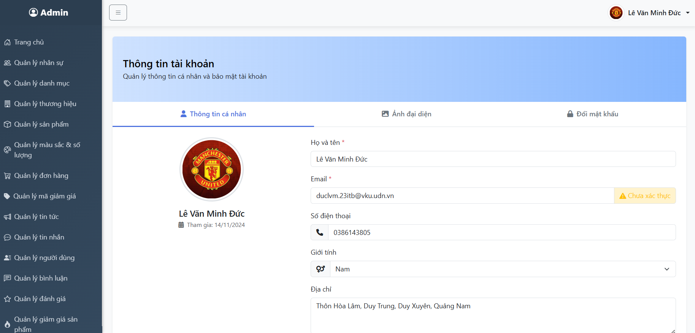

# Demo Kết Quả Đạt Được

## 📋 Giới thiệu
Đây là phần demo giao diện quản trị của dự án. Giao diện bao gồm các chức năng quản lý thương hiệu, nhân viên, sản phẩm, đơn hàng và nhiều tính năng khác.

## 📸 Các giao diện chính

### 1. Giao diện trang chủ

### 2. Quản lý thương hiệu

### 3. Quản lý nhân viên

### 4. Quản lý sản phẩm

### 5. Quản lý đơn hàng

### 6. Quản lý tin tức

### 7. Quản lý voucher

### 8. Quản lý bình luận sản phẩm

### 9. Quản lý đánh giá sản phẩm

### 10. Quản lý giảm giá sản phẩm

### 11. Quản lý thông tin cá nhân

## 🛠 Chức năng chính
- Quản lý thương hiệu
- Quản lý nhân viên
- Quản lý sản phẩm
- Quản lý đơn hàng
- Quản lý tin tức
- Quản lý voucher và giảm giá
- Quản lý bình luận và đánh giá
- Quản lý thông tin cá nhân