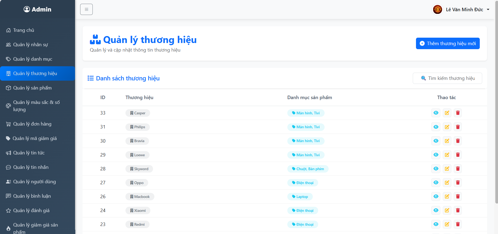
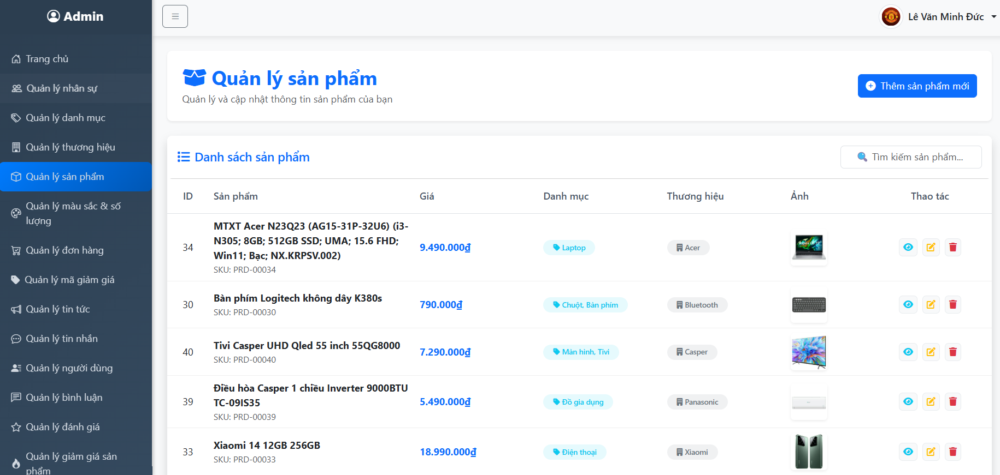
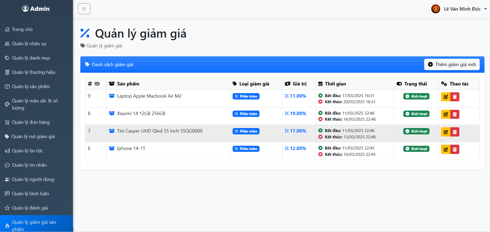

## 📋 Giới thiệu
Đây là phần demo giao diện quản trị của dự án. Dự án này sử dụng Laravel Sanctum để xác thực API, cung cấp các phương thức đăng ký, đăng nhập và quản lý sản phẩm, cũng như quản lý đơn hàng.

## Phần Front-end: https://github.com/MINHDUC0908/FE_WEB_PHONE

## Chức Năng Chính

- **Xác thực người dùng:** Đăng ký và đăng nhập người dùng sử dụng Laravel Sanctum.
- **Quản lý sản phẩm:** Tạo, cập nhật, xóa và hiển thị thông tin sản phẩm điện tử.
- **Quản lý đơn hàng:** Tạo, theo dõi và quản lý trạng thái đơn hàng.
- **Tích hợp các thanh toán trực tuyến:** VNPAY, ZALOPAY, PAYPAL.
- **Quản lý danh mục sản phẩm:** Cho phép phân loại sản phẩm theo danh mục (ví dụ: điện thoại, máy tính, v.v.).
- **Hỗ trợ tìm kiếm:** Cung cấp các phương thức tìm kiếm sản phẩm theo tên, loại và giá cả.

## Cài Đặt

### 1. Cài Đặt Dự Án

1. Clone dự án về máy của bạn:

   ```bash
   git clone https://github.com/MINHDUC0908/DUC_PHONE
   cd DUC_PHONE
   ```

2. Cài đặt các dependencies:

   Sau khi đã clone xong dự án, cài đặt các thư viện PHP yêu cầu cho dự án bằng Composer:

   ```bash
   composer install
   ```

### 2. Cấu Hình Môi Trường

1. Sao chép file `.env.example` thành `.env`:

   ```bash
   cp .env.example .env
   ```

2. Mở file `.env` và cập nhật các thông tin kết nối cơ sở dữ liệu của bạn, ví dụ:

   ```env
   DB_CONNECTION=mysql
   DB_HOST=127.0.0.1
   DB_PORT=3306
   DB_DATABASE=your_database_name
   DB_USERNAME=your_database_username
   DB_PASSWORD=your_database_password
   ```

3. Tạo một key ứng dụng Laravel:

   ```bash
   php artisan key:generate
   ```

4. Cấu hình queue (nếu sử dụng hàng đợi):

   Trong file `.env`, thay đổi cấu hình hàng đợi nếu bạn đang sử dụng cơ sở dữ liệu cho hàng đợi:

   ```env
   QUEUE_CONNECTION=database
   ```

5. Tạo bảng hàng đợi trong cơ sở dữ liệu:

   ```bash
   php artisan queue:table
   php artisan migrate
   ```
### 3. Cài Đặt Cơ Sở Dữ Liệu

### 1. Bảng `categories`

```sql
CREATE TABLE categories (
    id BIGINT(20) UNSIGNED NOT NULL AUTO_INCREMENT,
    category_name VARCHAR(255) COLLATE utf8mb4_unicode_ci,
    created_at TIMESTAMP NULL,
    updated_at TIMESTAMP NULL,
    PRIMARY KEY (id)
);
```

### 2. Bảng `brands`

```sql
CREATE TABLE brands (
    id BIGINT(20) UNSIGNED NOT NULL AUTO_INCREMENT,
    brand_name VARCHAR(255) COLLATE utf8mb4_unicode_ci,
    category_id BIGINT(20) UNSIGNED,
    created_at TIMESTAMP NULL,
    updated_at TIMESTAMP NULL,
    view INT(11) DEFAULT 0,
    PRIMARY KEY (id),
    FOREIGN KEY (category_id) REFERENCES categories(id)
);
```

### 3. Bảng `products`

```sql
CREATE TABLE products (
    id BIGINT(20) UNSIGNED NOT NULL AUTO_INCREMENT,
    product_name VARCHAR(255) COLLATE utf8mb4_unicode_ci,
    description TEXT COLLATE utf8mb4_unicode_ci,
    price DECIMAL(10,2),
    brand_id BIGINT(20) UNSIGNED,
    category_id BIGINT(20) UNSIGNED,
    images TEXT utf8mb4_unicode_ci,
    description_image TEXT utf8mb4_unicode_ci,
    created_at TIMESTAMP NULL,
    updated_at TIMESTAMP NULL,
    view_count INT(11) DEFAULT 0,
    PRIMARY KEY (id),
    FOREIGN KEY (brand_id) REFERENCES brands(id),
    FOREIGN KEY (category_id) REFERENCES categories(id)
);
```
### 4. Bảng colors

```sql
CREATE TABLE colors (
    id BIGINT(20) UNSIGNED NOT NULL AUTO_INCREMENT,
    name VARCHAR(255) COLLATE utf8mb4_unicode_ci,
    code VARCHAR(50) COLLATE utf8mb4_unicode_ci,
    product_id BIGINT(20) UNSIGNED,
    quantity INT(11) DEFAULT 0,
    created_at TIMESTAMP NULL,
    updated_at TIMESTAMP NULL,
    PRIMARY KEY (id),
    FOREIGN KEY (product_id) REFERENCES products(id)
) 
```

### 5. Bảng carts 

```sql
CREATE TABLE carts (
    id BIGINT(20) UNSIGNED NOT NULL AUTO_INCREMENT,
    customer_id BIGINT(20) UNSIGNED,
    status VARCHAR(255) COLLATE utf8mb4_unicode_ci DEFAULT 'pending',
    created_at TIMESTAMP NULL,
    updated_at TIMESTAMP NULL,
    PRIMARY KEY (id),
    FOREIGN KEY (customer_id) REFERENCES customers(id)
) 
```

### 6. Bảng cart_items 

```sql
CREATE TABLE cart_items (
    id BIGINT(20) UNSIGNED NOT NULL AUTO_INCREMENT,
    cart_id BIGINT(20) UNSIGNED,
    product_id BIGINT(20) UNSIGNED,
    color_id BIGINT(20) UNSIGNED,
    quantity INT(11) DEFAULT 1,
    total DECIMAL(12,2) DEFAULT 0.00,
    checked TINYINT(1) DEFAULT 1,
    created_at TIMESTAMP NULL,
    updated_at TIMESTAMP NULL,
    PRIMARY KEY (id),
    FOREIGN KEY (cart_id) REFERENCES carts(id),
    FOREIGN KEY (product_id) REFERENCES products(id),
    FOREIGN KEY (color_id) REFERENCES colors(id)
) 
```

### 7. Bảng shipping_address

```sql
CREATE TABLE shipping_address (
    id BIGINT(20) UNSIGNED NOT NULL AUTO_INCREMENT,
    customer_id BIGINT(20) UNSIGNED,
    name VARCHAR(255) COLLATE utf8mb4_unicode_ci,
    phone VARCHAR(255) COLLATE utf8mb4_unicode_ci,
    province VARCHAR(255) COLLATE utf8mb4_unicode_ci,
    district VARCHAR(255) COLLATE utf8mb4_unicode_ci,
    ward VARCHAR(255) COLLATE utf8mb4_unicode_ci,
    address VARCHAR(255) COLLATE utf8mb4_unicode_ci,
    created_at TIMESTAMP NULL,
    updated_at TIMESTAMP NULL,
    PRIMARY KEY (id),
    FOREIGN KEY (customer_id) REFERENCES customer(id)
) 
```

### 8. Bảng orders

```sql
CREATE TABLE orders (
    id BIGINT(20) UNSIGNED NOT NULL AUTO_INCREMENT,
    customer_id BIGINT(20) UNSIGNED,
    order_number VARCHAR(255) COLLATE utf8mb4_unicode_ci,
    total_amount DECIMAL(12,2),
    status ENUM('waiting_for_confirmation', 'processing', 'delivered') COLLATE utf8mb4_unicode_ci DEFAULT 'waiting_for_confirmation',
    payment_method VARCHAR(255) COLLATE utf8mb4_unicode_ci,
    payment_status VARCHAR(255) COLLATE utf8mb4_unicode_ci DEFAULT 'unpaid',
    created_at TIMESTAMP NULL,
    shipping_address_id BIGINT(20) UNSIGNED,
    coupon_id BIGINT(20) UNSIGNED,
    discount_amount DECIMAL(10,2) DEFAULT 0.00,
    PRIMARY KEY (id),
    FOREIGN KEY (customer_id) REFERENCES customer(id),
    FOREIGN KEY (shipping_address_id) REFERENCES shipping_address(id),
    FOREIGN KEY (coupon_id) REFERENCES coupon(id)
) 
```

### 9. Bảng order_items

```sql
CREATE TABLE order_items (
    id BIGINT(20) UNSIGNED NOT NULL AUTO_INCREMENT,
    order_id BIGINT(20) UNSIGNED,
    product_id BIGINT(20) UNSIGNED,
    quantity INT(11),
    color_id BIGINT(20) UNSIGNED,
    created_at TIMESTAMP NULL,
    updated_at TIMESTAMP NULL,
    PRIMARY KEY (id),
    FOREIGN KEY (order_id) REFERENCES orders(id),
    FOREIGN KEY (product_id) REFERENCES products(id),
    FOREIGN KEY (color_id) REFERENCES colors(id)
) 
```

### 10. Bảng payments

```sql
CREATE TABLE payments (
    id BIGINT(20) UNSIGNED NOT NULL AUTO_INCREMENT,
    order_id BIGINT(20) UNSIGNED,
    payment_gateway VARCHAR(255) COLLATE utf8mb4_unicode_ci,
    transaction_id VARCHAR(255) COLLATE utf8mb4_unicode_ci,
    amount DECIMAL(12,2),
    status ENUM('pending', 'success', 'failed') COLLATE utf8mb4_unicode_ci DEFAULT 'pending',
    created_at TIMESTAMP NULL,
    updated_at TIMESTAMP NULL,
    PRIMARY KEY (id),
    FOREIGN KEY (order_id) REFERENCES orders(id)
) 
```

### 11. Bảng coupons

```sql
CREATE TABLE coupons(
    id BIGINT(20) UNSIGNED NOT NULL AUTO_INCREMENT,
    code VARCHAR(255) COLLATE utf8mb4_unicode_ci,
    discount_amount DECIMAL(10,2),
    express_at DATETIME,
    quantity INT(11),
    created_at TIMESTAMP NULL,
    updated_at TIMESTAMP NULL,
    PRIMARY KEY (id)
)
```

### 12. Bảng vouchers

```sql
CREATE TABLE vouchers(
    id BIGINT(20) UNSIGNED NOT NULL AUTO_INCREMENT,
    code VARCHAR(255) COLLATE utf8mb4_unicode_ci DEFAULT NULL,
    type ENUM('percent', 'fixed', 'freeship') COLLATE utf8mb4_unicode_ci NOT NULL,
    value INT(11) NOT NULL,
    max_discount INT(11) DEFAULT NULL,
    min_order_amount INT(11) NOT NULL,
    quantity INT(11) NOT NULL DEFAULT 0,
    used INT(11) NOT NULL DEFAULT 0,
    user_id BIGINT(20) UNSIGNED DEFAULT NULL,
    start_date TIMESTAMP NULL DEFAULT NULL,
    end_date TIMESTAMP NULL DEFAULT NULL,
    created_at TIMESTAMP NULL DEFAULT NULL,
    updated_at TIMESTAMP NULL DEFAULT NULL,
    PRIMARY KEY (id)
    FOREIGN KEY (user_id) REFERENCES users(id)
)
```

### 13. Bảng ratings 

```sql
CREATE TABLE ratings(
    id BIGINT(20) UNSIGNED NOT NULL AUTO_INCREMENT,
    product_id BIGINT(20),
    customer_id BIGINT(20),
    rating TINYINT(3),
    image TEXT NOT NULL,
    comment VARCHAR(255) NOT NULL,
    created_at TIMESTAMP NULL DEFAULT NULL,
    updated_at TIMESTAMP NULL DEFAULT NULL,
    PRIMARY KEY (id)
    FOREIGN KEY (product_id) REFERENCES products(id)
    FOREIGN KEY (customer_id) REFERENCES customer(id)
)
```

### 14. Bảng discounts

```sql
CREATE TABLE discounts(
    id BIGINT(20) UNSIGNED NOT NULL AUTO_INCREMENT,
    product_id BIGINT(20),
    discount_type ENUM('percent', 'fixed'),
    discount_value DECIMAL(10,2),
    start_date DATETIME,
    end_start DATETIME,
    created_at TIMESTAMP NULL DEFAULT NULL,
    updated_at TIMESTAMP NULL DEFAULT NULL,
    PRIMARY KEY (id)
    FOREIGN KEY (product_id) REFERENCES products(id)
)
```

### 15. Bảng users

```sql
CREATE TABLE users (
    id BIGINT(20) UNSIGNED NOT NULL AUTO_INCREMENT,
    name VARCHAR(255) COLLATE utf8mb4_unicode_ci NOT NULL,
    email VARCHAR(255) COLLATE utf8mb4_unicode_ci NOT NULL,
    email_verified_at TIMESTAMP NULL DEFAULT NULL,
    password VARCHAR(255) COLLATE utf8mb4_unicode_ci NOT NULL,
    remember_token VARCHAR(100) COLLATE utf8mb4_unicode_ci DEFAULT NULL,
    is_locked TINYINT(1) DEFAULT 1,
    created_at TIMESTAMP NULL DEFAULT NULL,
    updated_at TIMESTAMP NULL DEFAULT NULL,
    phone VARCHAR(255) COLLATE utf8mb4_unicode_ci DEFAULT NULL,
    image VARCHAR(255) COLLATE utf8mb4_unicode_ci DEFAULT NULL,
    gender ENUM('male', 'female') COLLATE utf8mb4_unicode_ci DEFAULT NULL,
    birth_date DATE DEFAULT NULL
    PRIMARY KEY (id)
)
```

### 16. Bảng customers

```sql
CREATE TABLE customers (
    id BIGINT(20) UNSIGNED AUTO_INCREMENT PRIMARY KEY,
    google_id VARCHAR(255) COLLATE utf8mb4_unicode_ci NOT NULL,
    name VARCHAR(255) COLLATE utf8mb4_unicode_ci NOT NULL,
    email VARCHAR(255) COLLATE utf8mb4_unicode_ci NOT NULL,
    image TEXT COLLATE utf8mb4_unicode_ci NULL,
    date DATE NULL,
    gender INT(11) NULL,
    status VARCHAR(100) COLLATE utf8mb4_unicode_ci DEFAULT 'offline',
    selected INT(100) DEFAULT 1,
    password VARCHAR(255) COLLATE utf8mb4_unicode_ci NOT NULL,
    created_at TIMESTAMP NULL,
    updated_at TIMESTAMP NULL
    PRIMARY KEY (id)
)
```

### 17.Bảng user_coupons
``` sql
CREATE TABLE user_coupons(
    id BIGINT(20) UNSIGNED AUTO_INCREMENT PRIMARY KEY,
    customer_id BIGINT(20),
    coupon_id BIGINT(20),
    created_at TIMESTAMP NULL,
    updated_at TIMESTAMP NULL
    PRIMARY KEY (id)
    FOREIGN KEY (coupon_id) REFERENCES coupons(id)
    FOREIGN KEY (customer_id) REFERENCES customer(id)
)
```

### 18. Bảng comments

``` sql
CREATE TABLE comments (
    id BIGINT(20) UNSIGNED NOT NULL AUTO_INCREMENT,
    product_id BIGINT(20) UNSIGNED NOT NULL,
    customer_id BIGINT(20) UNSIGNED DEFAULT NULL,
    admin_id BIGINT(20) UNSIGNED DEFAULT NULL,
    parent_id BIGINT(20) UNSIGNED DEFAULT NULL,
    content TEXT CHARACTER SET utf8mb4 COLLATE utf8mb4_unicode_ci NOT NULL,
    created_at TIMESTAMP DEFAULT NULL,
    updated_at TIMESTAMP DEFAULT NULL,
    FOREIGN KEY (product_id) REFERENCES products(id)
    FOREIGN KEY (customer_id) REFERENCES customer(id)
    PRIMARY KEY (id)
);

```

### 19. Tạo bảng `permissions`
```sql
CREATE TABLE permissions (
    id BIGINT UNSIGNED NOT NULL AUTO_INCREMENT,
    name VARCHAR(125) NOT NULL,
    guard_name VARCHAR(25) NOT NULL,
    created_at TIMESTAMP NULL,
    updated_at TIMESTAMP NULL,
    PRIMARY KEY (id),
    UNIQUE KEY unique_name_guard_name (name, guard_name)
) ENGINE=InnoDB DEFAULT CHARSET=utf8mb4 COLLATE=utf8mb4_unicode_ci;

```

### 20. Bảng roles

```sql
CREATE TABLE roles (
    id BIGINT UNSIGNED NOT NULL AUTO_INCREMENT,
    name VARCHAR(125) NOT NULL,
    guard_name VARCHAR(25) NOT NULL,
    created_at TIMESTAMP NULL,
    updated_at TIMESTAMP NULL,
    PRIMARY KEY (id),
    UNIQUE KEY unique_name_guard_name (name, guard_name)
) ENGINE=InnoDB DEFAULT CHARSET=utf8mb4 COLLATE=utf8mb4_unicode_ci;

```
### 20. Bảng model_has_permissions

```sql
CREATE TABLE model_has_permissions (
    permission_id BIGINT UNSIGNED NOT NULL,
    model_type VARCHAR(255) NOT NULL,
    model_id BIGINT UNSIGNED NOT NULL,
    INDEX model_has_permissions_model_id_model_type_index (model_id, model_type),
    FOREIGN KEY (permission_id) REFERENCES permissions(id) ON DELETE CASCADE,
    PRIMARY KEY (permission_id, model_id, model_type)
) ENGINE=InnoDB DEFAULT CHARSET=utf8mb4 COLLATE=utf8mb4_unicode_ci;
```
### 21. Bảng model_has_permissions

```sql
CREATE TABLE model_has_roles (
    role_id BIGINT UNSIGNED NOT NULL,
    model_type VARCHAR(255) NOT NULL,
    model_id BIGINT UNSIGNED NOT NULL,
    INDEX model_has_roles_model_id_model_type_index (model_id, model_type),
    FOREIGN KEY (role_id) REFERENCES roles(id) ON DELETE CASCADE,
    PRIMARY KEY (role_id, model_id, model_type)
) ENGINE=InnoDB DEFAULT CHARSET=utf8mb4 COLLATE=utf8mb4_unicode_ci;
```
### 22. Bảng model_has_permissions

```sql
CREATE TABLE role_has_permissions (
    permission_id BIGINT UNSIGNED NOT NULL,
    role_id BIGINT UNSIGNED NOT NULL,
    FOREIGN KEY (permission_id) REFERENCES permissions(id) ON DELETE CASCADE,
    FOREIGN KEY (role_id) REFERENCES roles(id) ON DELETE CASCADE,
    PRIMARY KEY (permission_id, role_id)
) ENGINE=InnoDB DEFAULT CHARSET=utf8mb4 COLLATE=utf8mb4_unicode_ci;
```


# Demo Kết Quả Đạt Được

## 📸 Các giao diện chính

### 1. Giao diện trang chủ


### 2. Quản lý thương hiệu


### 3. Quản lý nhân viên


### 4. Quản lý sản phẩm


### 5. Quản lý đơn hàng


### 6. Quản lý tin tức


### 7. Quản lý voucher


### 8. Quản lý bình luận sản phẩm


### 9. Quản lý đánh giá sản phẩm


### 10. Quản lý giảm giá sản phẩm


### 11. Quản lý thông tin cá nhân


## 🛠 Chức năng chính
- Quản lý thương hiệu
- Quản lý nhân viên
- Quản lý sản phẩm
- Quản lý đơn hàng
- Quản lý tin tức
- Quản lý voucher và giảm giá
- Quản lý bình luận và đánh giá
- Quản lý thông tin cá nhân\


